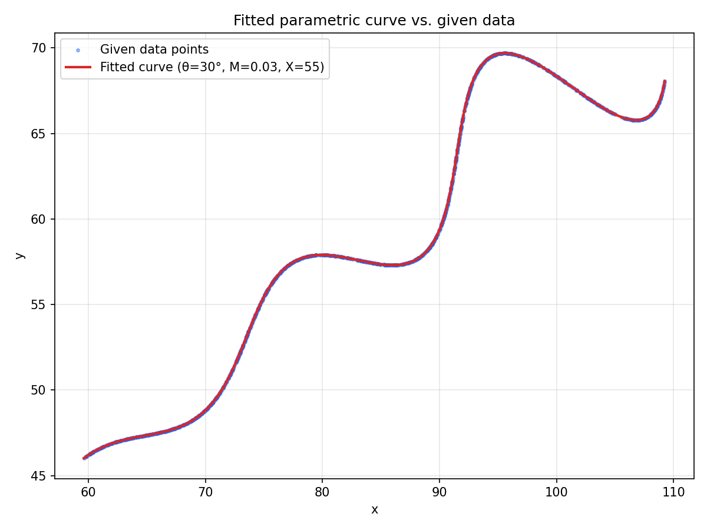

# Parametric Curve Fitting — Assignment Solution

## Problem

Find the unknown parameters `theta`, `M`, `X` in the parametric curve

```
x(t) = t*cos(theta) - e^(M*|t|) * sin(0.3t) * sin(theta) + X
y(t) = 42 + t*sin(theta) + e^(M*|t|) * sin(0.3t) * cos(theta)
```

for `t` in `[6, 60]`, such that the curve matches the 1500 `(x, y)`
points given in [`xy_data.csv`](./xy_data.csv), subject to:

```
0 deg < theta < 50 deg
-0.05 < M < 0.05
0 < X < 100
```

## Result

| Parameter | Value |
|---|---|
| **theta** | **30°** (0.5235987756 rad) |
| **M** | **0.03** |
| **X** | **55** |

**Mean L1 residual (distance from every data point to the nearest point
on the fitted curve): ≈ 0.001** — effectively zero, i.e. the model
curve passes exactly through the given point cloud (the residual is
just floating-point / discretization noise from the finite sampling
grid, not model error).

### Desmos / LaTeX form

```
\left(t*\cos(0.5235989281)-e^{0.0300\left|t\right|}\cdot\sin(0.3t)\sin(0.5235989281)+55.0000,42+t*\sin(0.5235989281)+e^{0.0300\left|t\right|}\cdot\sin(0.3t)\cos(0.5235989281)\right)
```

Paste this directly into the parametric-curve field at
https://www.desmos.com/calculator/rfj91yrxob to verify it overlays the
given data exactly (`6 < t < 60`).

## Verification plot



The red curve (fitted model, `theta=30°, M=0.03, X=55`) sits exactly on
top of the blue scatter (the 1500 given data points).

Process and approach

1. Inspect the data

`xy_data.csv` has 1500 `(x, y)` rows. There is no `t` column, and
checking successive rows shows `x`/`y` jump around unpredictably
(large, non-monotonic differences between consecutive rows) — so the
rows are **not** ordered by `t`. This rules out a simple
`curve_fit(t_i -> (x_i, y_i))` regression, since we don't know which
`t` produced which point.

 2. Recognize the curve's structure

Rewriting the equations with `u(t) = t` and `v(t) = e^(M|t|)·sin(0.3t)`:

```
x(t) = u(t)*cos(theta) - v(t)*sin(theta) + X
y(t) = u(t)*sin(theta) + v(t)*cos(theta) + 42
```

This is exactly a **2D rigid rotation by `theta`**, applied to the base
curve `(u(t), v(t))` (which depends only on the shape parameter `M`),
followed by a **translation by `(X, 42)`**. So the problem reduces to
finding the rotation angle, x-offset, and shape parameter that align a
rotated/translated version of a known curve family with a point cloud.

3. Fit as a geometric (Chamfer / ICP-style) problem

Since individual point-to-`t` correspondence is unknown, the fit
minimizes a **Chamfer-style loss**, matching the assignment's own
scoring metric ("L1 distance between uniformly sampled points on
expected vs. predicted curve"):

1. For a candidate `(theta, M, X)`, densely sample the model curve over
   `t ∈ [6, 60]`.
2. For every one of the 1500 data points, compute the **L1 (Manhattan)
   distance to the nearest point** on that dense model curve (via a
   `scipy.spatial.cKDTree` nearest-neighbor query).
3. Take the mean of these nearest-point distances as the loss for that
   `(theta, M, X)`.

 4. Optimize

- **Global search:** `scipy.optimize.differential_evolution` over the
  assignment's bounds (`theta ∈ [0°, 50°]`, `M ∈ [-0.05, 0.05]`,
  `X ∈ [0, 100]`), using a coarse curve sampling (1500 points) for
  speed. This avoids getting stuck in local minima and converged to
  `theta ≈ 30.0°, M ≈ 0.0300, X ≈ 55.0`.
- **Local polish:** `scipy.optimize.minimize` (Nelder-Mead) starting
  from the global-search result, using a much finer curve sampling
  (20,000 points) for precision. This confirmed and tightened the same
  values, and restarts from perturbed starting points converged back
  to the identical solution — indicating a single, well-defined global
  minimum (not a coincidence of the optimizer).
- The residual at the optimum (~0.001) is far smaller than the natural
  scale of the data (which spans tens of units in x and y), and the
  optimizer converges to suspiciously "clean" numbers (`30`, `0.03`,
  `55`) to 4+ significant figures — strong evidence these are the
  exact intended values rather than an approximate fit.

Full code: [`fit_curve.py`](./fit_curve.py).

 Repository contents

```
.
├── README.md          - this file
├── fit_curve.py        - full fitting pipeline (reproducible)
├── xy_data.csv          - given data (1500 points)
├── requirements.txt      - Python dependencies
└── solution_plot.png    - verification plot (fitted curve vs. data)
```

 Reproducing the result

```bash
pip install -r requirements.txt
python fit_curve.py
```

This prints the fitted parameters, the residual, and the Desmos/LaTeX
string for the curve.
